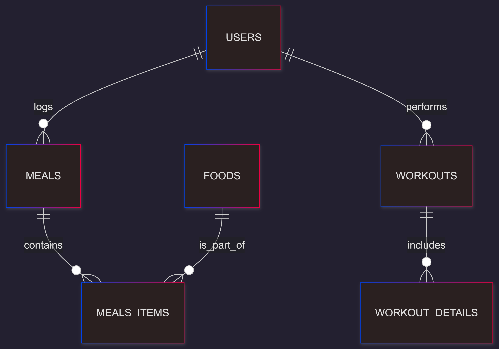

# Design Document

By Hector Fallara

Video overview: <[URL HERE](https://youtu.be/4rCdqYd8TnM)>

## Scope

The purpose of this database is to provide a robust infrastructure for a health tracking system, specifically focused on nutritional management and physical performance monitoring (weightlifting and cardio). Included in the database's scope are:

* Users: Storage of individual profiles with biometric data and caloric goals.
* Nutrition: A food catalog with detailed macronutrient information and a record of daily meals composed of multiple items.
* Training: Records of exercise sessions categorized by type, including technical details for each exercise (sets, reps, and load).

Out of scope are elements like specific supplement tracking, real-time GPS integration, sleep management, or complex social networking features for user interaction.

## Functional Requirements

This database will support:

* CRUD operations for user profiles and the food catalog.
* Daily logging of food intake, allowing a single meal to contain multiple food items in varying quantities.
* Monitoring of workout routines, supporting multiple exercises per session with tracking of load and volume progression.
* Queries for progress analysis, such as a consolidated view of weightlifting workouts through a dedicated View.

Note that in this iteration, the system will not support "recipes" (pre-defined combinations of foods) or automatic caloric expenditure calculation based on Basal Metabolic Rate formulas directly within SQL.

## Representation

### Entities

#### Users

The users table stores the central profile of the individual:

* id: Primary key of type INTEGER.
* username: Unique identifier of type TEXT. A UNIQUE constraint ensures no duplicate accounts.
* age, height, weight, goal_calories: Biometric attributes and goals represented by INTEGER and REAL. REAL is used for height and weight to allow decimal precision.

#### Foods

The foods table functions as a nutritional library:

* id: Primary key of type INTEGER.
* name: Name of the food item (TEXT) with a UNIQUE constraint.
* calories, carbs, protein, fat, fiber: Nutritional information represented by INTEGER and REAL.

#### Meals

The meals table records the occurrence of a nutritional event:

* id: Primary key of type INTEGER.
* user_id: Foreign key of type INTEGER referencing the users table.
* meal_type: Categorization of the event as TEXT. A CHECK constraint restricts values to 'breakfast', 'lunch', 'snack', or 'dinner'.
* date: The timestamp of the meal stored as NUMERIC with a DEFAULT CURRENT_TIMESTAMP constraint.

#### Meals_items

The meals_items table serves as a join table to facilitate the many-to-many relationship between meals and foods:

* food_id: Foreign key of type INTEGER referencing the foods table.
* meal_id: Foreign key of type INTEGER referencing the meals table.
* quantity: An INTEGER representing the amount of the food item consumed.
* PRIMARY KEY("food_id", "meal_id"): A composite primary key ensuring each food item is logged only once per specific meal.

#### Workouts

The workouts table serves as the header for a training session:

* id: Primary key of type INTEGER.
* user_id: Foreign key of type INTEGER referencing the users table to associate the session with a specific profile.
* date: The timestamp of the session stored as NUMERIC. A DEFAULT CURRENT_TIMESTAMP constraint automates the logging of the entry.
* activity: Type of exercise stored as TEXT. A CHECK constraint restricts values to 'weightlifting', 'cardio', 'sports', or 'yoga'.
* duration: The length of the session represented as NUMERIC.

#### Workouts_details

The workout_details table stores the specific execution of each exercise within a workout:

* id: Primary key of type INTEGER.
* workout_id: Foreign key of type INTEGER referencing the workouts table to link the details to a specific session.
* exercise_name: The name of the exercise performed as TEXT. A NOT NULL constraint ensures every entry identifies the movement.
* sets, reps: Volume of the exercise represented by INTEGER.
* weight_kg: The load used for the exercise stored as REAL to allow for decimal precision

### Relationships

The relationships among the entities are described below:

* Users to Meals and Workouts: A one-to-many relationship exists between users and their logs. A single user can record multiple meals and multiple workout sessions over time, but each meal or workout record belongs to exactly one user.
* Meals to Foods (via Meals_Items): This represents a many-to-many relationship. A single meal can consist of multiple different food items, and conversely, the same food item can be part of many different meals logged across the system.
* Workouts to Workout_Details: A one-to-many relationship connects a workout session to its technical details. This allows one training session to include various exercises, each with its own specific sets, repetitions, and weight used.

## Optimizations

The following optimizations were implemented:

* Indexes: Indexes were created on users(username) and foods(name) to speed up profile and food lookups by name, which are the most common expected search operations.
* Join Optimization: The index meal_items_lookup on meals_items(meal_id, food_id) was created to optimize join speed when reconstructing a user's full meal in a query.
* Views: The weightlift_workout view was created to simplify access to weightlifting data, automatically joining user, workout, and detail tables while filtering specifically for weightlifting activity.

## Limitations

Limitations of the current design include:

* Fixed Quantities: The meals_items table uses INTEGER for quantity. If a user consumes 1.5 portions or 150.5g, the current schema may round the value or require conversion to a smaller unit.
* Static Check Constraints: Physical activities and meal types are hardcoded in the schema. Adding a new activity type (e.g., "swimming") would require a structural change to the table (ALTER TABLE).
* Lack of Units: There is no column to define the unit of measurement (grams, ml, units) in the foods table, assuming an implicit standard.
